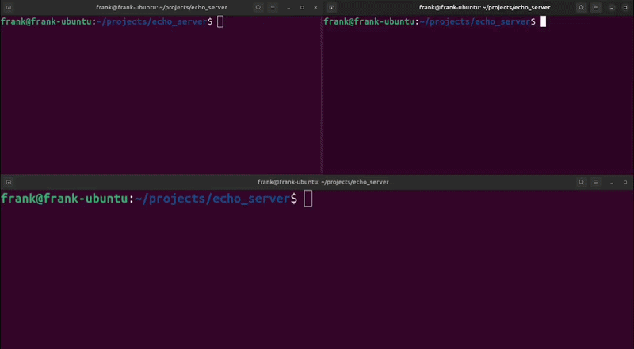

# Echo Server



A simple server which echoes back whatever the client transmits.

Made for learning purposes, referenced from the book "Beej’s Guide to Network Programming" by Brian “Beej Jorgensen” Hall

## Specifications
- Uses Stream Socket and TCP
- Uses a fixed-size thread pool of 12 worker threads (configurable in the source) to serve multiple clients concurrently.
- Listens on TCP port 7777 by default (modifiable in the source).
- A client can terminate its session by sending "exit".

## How to use

### Server

Compile the server
```bash
g++ -std=c++17 server.cpp -o server -pthread
```
Run the server
```bash
./server
```
### Client

Compile the client
```bash
g++ -std=c++17 client.cpp -o client
```
Run the client with the address to the server

If on the same machine, then open another terminal and run:
```bash
./client localhost
```

If on different machine
```bash
./client <ip_address>
```

## Requirements
- POSIX-compliant operating system (Linux, macOS, BSD)
- C++17 or later
- TCP port 7777 must be available, or change the `PORT` constant in the source.